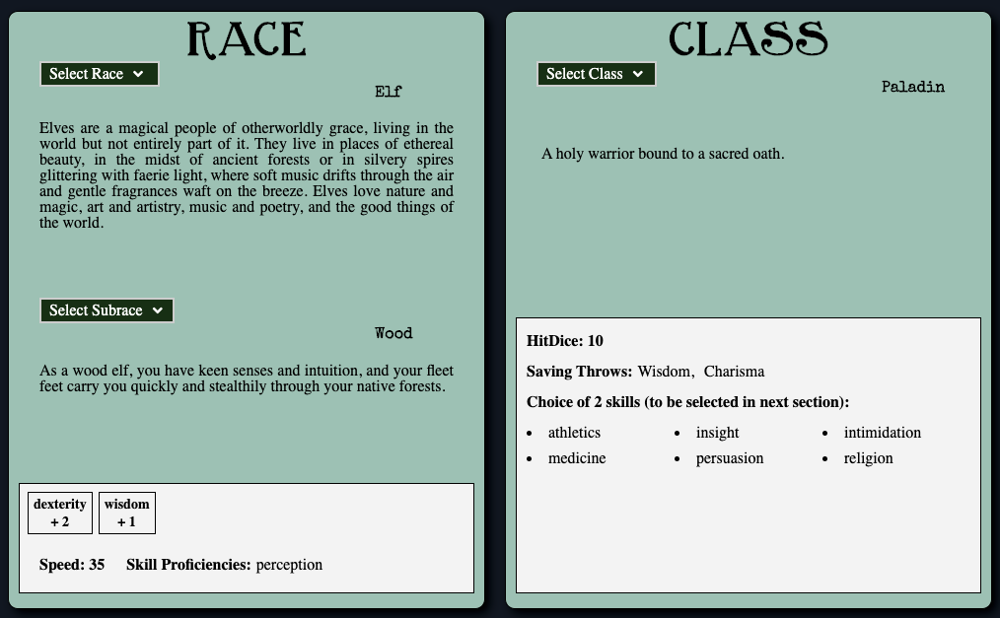
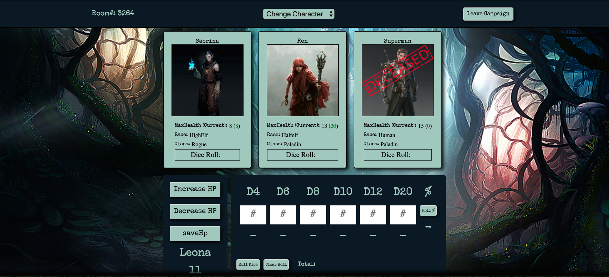

# D&M

Dungeons and Management is a character building and game play aid for the popular role playing game, Dungeons and Dragons.

Live Link (https://dungeons-and-management.herokuapp.com/#/)

## Technologies Used

* Websockets were implemented for real time dice rolling/sharing and updating character health in the group campaign room.
* Vast utility files were created to store highly specific game data and conversion factors based on character stats.
* React and Redux were used on the frontend to create modularized components which could be rendered in multiple areas of the site.
* MongoDB and Node.js were used for the backend and database allowing for quick setup by removing the need for a relational database.
* JWT, BCrypt, and Passport were used for encryption and authentication of user login information. 
* CSS/SASS provided the ability to use variables and nesting relations fof the styling elements to create the desired thematic appearance.

## Features

Automatically filling character creation sheets were one of the main features of our site. By storing all the relevant information in our files 
this really take away a lot of the tedious aspects to D&D character building. Although an awesome feature, it was definitely also one of the most
time consuming features based on the amount of logic required. 




The campaign room relied on many components already being used in other parts of the app. To create clean and readable code
many helper functions were defined and called in the rendering of the campaign.



```
render() {
		if (this.state.loaded) {
			return (
				<div id="campaignContainer">
					<div className="main-page-background-img">
						
					</div>
					<div id="campaign-info-container">
						<h3>{`Room#: ${this.props.campaign.campKey}`}</h3>
						{this.renderCurrentCharForm()}
						<button onClick={() => this.handleLeaveClick() }>Leave Campaign</button>
					</div>
					<ul id="char-boxes">{this.renderChars()}</ul>
					<div id='dice-hp-container'>
						{this.currentCharExists() ? this.renderHpButtons() : null}
						<Dice 
							socket={this.socket}
							currentChar={this.state.currentChar}
							characters={this.props.characters}
						/>
					</div>
					{this.currentCharExists() ? this.renderCharShow() : null}
				</div>
			);
		}
}
```

## Moving Forward

* Connecting with a D&D API in the future would allow us to import data regarding items, spells, and weapons to allow
users to connect their characters with these great features. 
* In campaign live chat would allow for users to converse directly on the web app as well during gameplay. 


